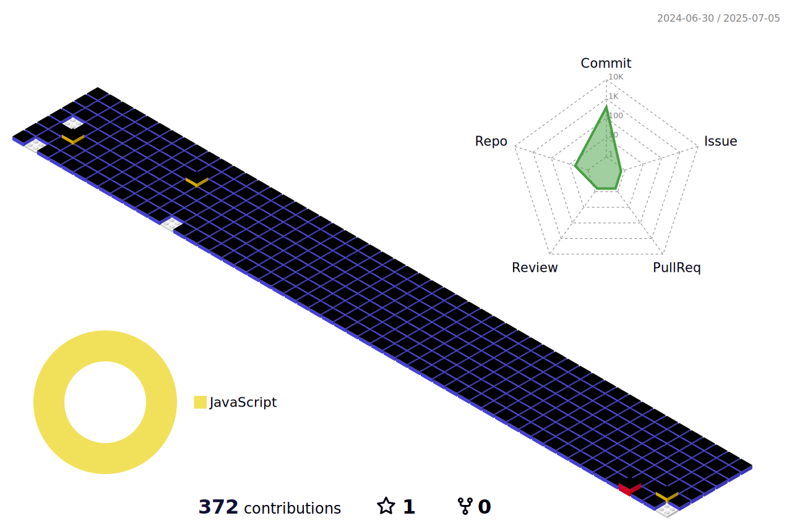

<div align="center">
  <a href="https://codewan.cn">
    
  </a>
</div>

## Hi, 👋 I'm Yg

- 🌱 擅长`Vue3` 、 `Vite` 、 `React`和 `TypeScript`
- 📫 联系方式: 33358115@qq.com

### Languaues and Tools

<span > 
   
   
   
   
   
   
   
   
   
    
</span>

### My GitHub Contributions


### My GitHub Stats

<div align="left">
   
  
</div>
<!-- <div align="left">
  
</div> -->

### My Activities

<!--START_SECTION:waka-->

```txt
From: 18 January 2024 - To: 17 January 2025

Total Time: 0 secs

No activity tracked
```

<!--END_SECTION:waka-->

### My GitHub Contributions


